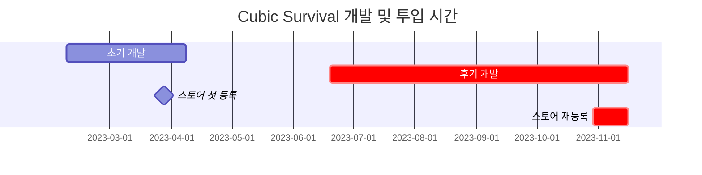

# **들어가며**



# **비주얼 디자인**

<!-- 디자인: 개인적으로 구현하는 재미도 있어서 신경을 많이 썼다.-->

### **무기 디자인**

{: w="960" .shadow }
_무기 디자인 적용 초기. 이때는 모든 적에게 URP Light2D를 부착했었다._

호기심에 클립스튜디오를 이용해 무기 디자인을 조금 더 그럴듯하게 바꾸었습니다. 퀄리티 좋은 에셋은 시간을 많이 요구한다는 현실적인 이유도 있고, **[앞서 설명했듯이](https://hynrang.github.io/posts/Cubic-Survival-Alpha/)** 개인적으로 미니멀리즘적 디자인을 원하기도 했어서 자연스럽게 픽셀아트 느낌으로 접근하게 되었네요.

{: w="480" .shadow }
{: w="480" .shadow }

총구 화염은 클립스튜디오가 제공하는 애니메이션 기능을 활용해 구현했습니다. **[이전에](https://hynrang.github.io/posts/LAV/)** 공식 에셋을 잘 활용한 경험이 있어서 이번에도 다른 에셋을 사용할까 했지만, 제가 원하는 느낌에 딱 맞는 에셋을 찾아보기 힘들기도 했어서 이번에는 직접 만들어 썼어요. 만들면서는 **[다른 슈팅 애니메이션](https://www.youtube.com/watch?v=kAafHZcT2fc)**을 참고하면서 제가 원하는 느낌을 잡아갔습니다.

<!--유니티 에디터 -> 탄피배출 GIF-->
<!--탄피배출 효과는 파티클이펙트로 구현했습니다.-->

{: w="960" .shadow }
{: w="960" .shadow }
```cs
if (shotTimer > fireThreshold)
{
    /* ... */
    WeaponAnimator.SetTrigger("Fire");
}

shotTimer += Time.deltaTime;
```
{: file="Weapon.cs" }

애니메이션을 구현하면서 유니티 애니메이션 컴포넌트를 처음 사용해봤습니다. 생각보다 굉장히 직관적으로 만들어져 있어서 사용하기가 편했어요. 다른 기능을 이것저것 만져보니 단순히 여러 장의 사진을 연속적으로 보여주는 기능 외에도 오브젝트의 위상을 원하는 형태로 재생할 수 있도록 만들어져 있어서 무기 발사시   간단한 반동 애니메이션도 재생되도록 만들었습니다.

처음 적용했을 때는 전체적으로 어딘가 부족한 느낌이 들었었는데, URP Light2D를 부착하고 총구 화염 크기를 조금 과장하니 화려하면서도 묵직한 느낌이 살아나면서 훨씬 나은 모습이 되었습니다.

#### **재장전**

### **애니메이션**

전에 지인과 "게임을 하는 이유"를 주제로 나눈 대화를 인용하고 싶은데요, 지인은 사람들이 오늘날 게임을 하는 이유로 "성장하고 모으는 재미"를 주된 이유로 꼽은 반면 저는 그것보다는 "화면 속 캐릭터가 힘차게 움직이는 모습을 구경하는 재미"를 주된 이유로 꼽았거든요.

찾아보니 스켈레톤 애니메이션이라던가, 절차적 애니메이션이라던가 등등 유니티가 제공하는 애니메이션 시스템 속에도 흥미로운 스킬이 많이 있는 것 같아 다음에 시도해보려고 합니다.

### **이미지 디자인**

### **움직임 애니메이션**

<!--유니티 에디터 -> 애니메이션 연결된거-->

조이스틱을 끝까지 끌면 달리기

### **메인메뉴 진입**

{: .shadow }
{: .shadow }
{: .shadow }

### **피격 파티클 이펙트**

- 그래프 만든거 보여주자

### **에셋 디자인**

- 아이템 디자인
    - 부끄럽다.

### **카메라**

**[사진 취미](https://hynrang.github.io/posts/%EC%9E%84%EC%9D%B8%EB%85%84%EC%9D%98-%EC%82%AC%EC%A7%84/)**를 시작하면서 느꼈던 점을 인용하고 싶은데요, 그림이든 사진이든 영상이든, 혹은 유니티 씬 렌더링이든 2차원 형식의 표현에 있어서 원하는 느낌을 만들고 싶을 때 고려해야 하는 첫 번째가 화각(FOV)이라고 생각했습니다.  
엄밀히 말하면 2D환경은 정사영(Orthographic)과 같이 씬을 렌더링하므로 3D환경과 2D환경에서의 화각의 개념에는 차이가 있지만, "얼마나 더 넓게 담을 것인가"의 추상적인 관점에서는 2D에서도 고민할 부분이 있다고 생각했어요.

예를 들어 재장전시 화각이 좁아지는 과정 설명. 재장전할 때 플레이어가 잠시 무력해저야 한다고 생각했다. 근데 너무 확대해보니 또 좀 그래서 살짝만 했음.

- post-pricessing
- bloom
- blur 오류


# **후기 개발**

### **객체지향 설계**

### **EXP 바**

### **크리티컬**

### **적 추가**

(현재 메인메뉴 GIF)

# **스토어 등록**

# **문제**

- 오디오 생각치도 못함.
- 애니메이션 리소스 너무 많이 잡아먹음. 하다보면...재밌긴 한데...다른걸 못함.

<br><br><br><br><br><br><br>

# 화면비

1. 접근성을 높이려면 세로가 적합
2. 깊이를 노핑려면 가로가 적합
    => 일반적으로 몰입감을 제공하는 컨텐츠는 가로로 김. Ex. 영화) 21:9

관성적으로 가로로 개발했는데, 트렌드에 거스르는 실수라고 생각한 적도 있었으나 개발이 진전되면서 적합한 선택이었다고 생각.

<br>

---

# 예술적 목표
    => "내부적으로는 2010년대 중반까지의 프랜차이즈 모방"
        - 세부 디테일에 관해
            - cam.orthographicSize 조정에 최대한 관여
            - cam.transform.position 조정에 최대한 관여
            - 탄피 particleEffect
            - 총구 화염 Animation
            - 
        - 만들면서 참고한 레퍼런스
            - **Pebble**
            - MW Reboot
    => "외부적으로는 끊김없는 2020년대 오늘날의 프랜차이즈 트렌드 반영or구현"
        - 세부 디테일에 관해
            - 진입시 cam.orthographicSize 조정과 일부 애니메이션 사용으로 자연스러움 구현 시도
                - 배틀필드 1부터 도입되어 2042까지 이어지고 있는 Spawn 애니메이션에서 영감
        - URP, Post Processing 적극 사용
            - URP는 처음에는 불편했으나 차차 익숙해짐
                - 그러나 Light2D와 Shadow는 잡아먹는 GPU 리소스가 많아 최적화상 리젝
            - Post Processing에 관해
                - 2D에서 (일반적으로 3D에서 더 많이 보이는) MotionBlur를 적용함.
                - Bloom 효과 적용으로 암부 대비 명부 비주얼 극대화
    => UI
        - 처음에는 극단적인 미니멀리즘을 구현하는데 목표
            - 그러나 미니멀리즘지향적인 UI를 (피그마로) 구상하면서, 미니멀리즘의 핵심이 '압축'이라는 것을 체감.
                - 제대로 된 압축을 찾기 위해 여러가지 시안을 만들어봐야 했고, 개발과 디자인을 모두 도맡아 하는 1인이 하기에는 매우매우 비효율적임을 체감
                - 심지어는 "기존과 다른 것"을 찾아내고 싶다는 개인적 목표를 만족시키고자 했다. 여러가지 시안이 리젝됐고, 더더욱 비효율적이었음.
            - 두 개의 한정된 조이스틱, 플레이어로부터 튀어나오는 8개 Square 인벤토리, 상단과 하단의 Ammo, Health가 그 흔적.
            - 미니멀리즘에 대한 집착을 버리자 작업물이 풍성해짐.
                - Ex. 총구 화염을 노랑, 주황 계열로 바꾸자 비주얼의 몰입도가 증폭됨.
                    - 상용화된 트리플A 프렌차이즈 FPS게임으로부터 색감을 따옴
                - Player에 발을 달고, Enemy를 다양화하자 풍성해지고 "재밌어짐"
                    - 왜 재밌는지는 의문.
                    - PVE Ravenfield로부터 힌트를 얻을 수 있을듯.

<br>