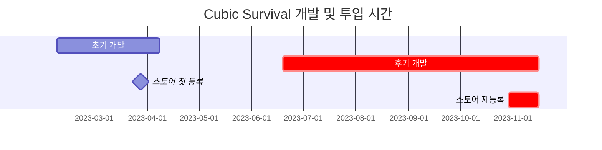
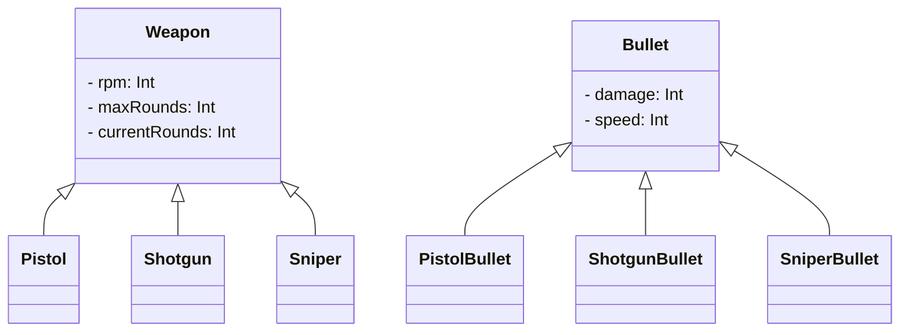

# **들어가며**

**[전 포스트](https://hynrang.github.io/posts/Cubic-Survival-Alpha/)**에서 이어지는 모바일 게임 개발기입니다. 위에서 정리한 대로 개발기간이 초기와 후기로 나뉘기 때문에 포스트를 분리해 정리했어요. 따라서 이 포스트에서는 차트에서 빨갛게 강조된 후기 개발과 스토어등록 부분을 다룹니다.



# **무기 디자인**

## **동작 애니메이션**

<!--유니티 에디터 -> 탄피배출 GIF-->
<!--탄피배출 효과는 파티클이펙트로 구현했습니다.-->

{: w="960" .shadow }
{: w="960" .shadow }
```cs
if (shotTimer > fireThreshold)
{
    WeaponAnimator.SetTrigger("Fire");
}

shotTimer += Time.deltaTime;
```
{: file="Weapon.cs" }

애니메이션을 구현하면서 유니티 애니메이션 컴포넌트를 처음 사용해봤습니다. 생각보다 굉장히 직관적으로 만들어져 있어서 사용하기가 편했어요. 다른 기능을 이것저것 만져보니 단순히 여러 장의 사진을 연속적으로 보여주는 기능 외에도 오브젝트의 위상을 원하는 형태로 재생할 수 있도록 만들어져 있어서 간단한 반동 애니메이션도 함께 만들었습니다.

처음 만들었을 때는 어딘가 부족한 느낌이 있었는데, 화염 크기를 과장하고 URP Light2D를 활용하니 훨씬 화려한 효과를 얻을 수 있었습니다.

{: w="480" .shadow }
{: w="480" .shadow }

총구 화염은 클립스튜디오의 애니메이션 기능을 활용해 구현했습니다. 이전에 공식 에셋을 잘 활용한 경험이 있어서 이번에도 만들어져 있는 에셋을 사용할까 했지만, 제가 원하는 느낌에 딱 맞는 에셋을 찾아보기 힘들기도 했어서 이번에는 직접 만들어 썼어요. 만들면서는 **[다른 슈팅 애니메이션](https://www.youtube.com/watch?v=kAafHZcT2fc)** 등을 참고하면서 제가 원하는 느낌을 잡아갔습니다.

{: w="960" .shadow }
<!--코드-->

오브젝트가 새로 나타날때의 부자연스러움을 덜기 위해 무기를 바꾸거나 새로 얻었을 때에만 재생되는 애니메이션도 만들었습니다. 무기 전체를 덮는 실루엣 이미지가 서서히 투명해지는 사이에 플레이어가 총기를 살짝 조작하는 듯한 느낌이 나타나도록 했어요.

## **적 피격 이펙트**

{: w="960" .shadow }
{: w="960" .shadow }
```cs
public void Hit()
{
    ParticleSystem hitEnemyParticle = hit.collider.GetComponent<ParticleSystem>();
    hitEnemyParticle.Emit(particleNumber);
}
```
{: file="Bullet.cs" }

피격 효과는 파티클 시스템을 사용했습니다. 처음에는 파티클의 움직임을 무작위 방향으로 움직이다가 속도가 점점 줄어드는 정도로만 단순히 구현했다가, 생각보다 많이 어색해서 이걸 어떻게 구현해야 좋을지 고민을 좀 했습니다.

이는 좀 우연찮게 해결했는데요, 위처럼 Velocity over Lifetime 모듈에서 선형 속도와 공전 속도를 Random between two curves로 설정하고 그래프를 두번 꼬았더니 마치 먼지가 이는 듯한 효과가 만들어지더라구요. 보기에도 괜찮고 타격감도 꽤나 좋게 만들어주는 것 같아 그대로 사용했습니다.

## **장탄수 시스템**

{: w="960" .shadow }
{: w="960" .shadow }
```cs
public virtual void Update()
{
    if (roundsCurrent > 0)
        Fire();
    else if (!WeaponAnimationInfo.IsTag("Weapon_Reload"))
        WeaponAnimator.SetTrigger("RoundIsEmpty");
    else
        roundsCurrent = roundsMax;
}

public virtual void Fire()
{
    if      (currentRounds == 1) WeaponAnimator.SetTrigger("FiredLastRound");
    else if (currentRounds > 0)  WeaponAnimator.SetTrigger("Fired");

    roundsCurrent -= 1;
}
```
{: file="Weapon.cs" }

남은 총알을 표시하는 기능을 만들었습니다. 총알이 0이 되면 재장전 애니메이션이 재생되고, 재장전 애니메이션이 끝나면 장탄수는 무기 오브젝트에 설정된 최대 장탄수 값으로 회귀하도록 만들었어요. 플레이어 체력과 마찬가지로 UI가 난잡하게 되지 않도록 장탄수 UI는 플레이어의 머리 위에 게임오브젝트 형태의 UI로 표시되도록 만들었습니다.

재장전 애니메이션이 재생되는 도중에 무기가 바뀔 경우 장탄수가 제대로 채워지지 않은 채 무기 애니메이터 컴포넌트의 `bool`형 `magazineIsEmpty` 변수가 `true`로 설정되어 앞서 소개한 `Gained` 애니메이션과 구별되는 `GainedEmpty` 애니메이션이 재생되도록 만들었습니다.

## **데미지 이펙트**

_일반 데미지이펙트 GIF_
_데미지이펙트 애니메이션 창_

데미지 이펙트 기능 자체는 초기 개발 때 구현했지만, 애니메이션이 아닌 코드로 구현되어 있기도 했고 그 비주얼도 많이 아쉬워서 조금 다듬어주었습니다.

만들면서 치명타도 간단하게 구현했는데, 무기별 확률에 따라 데미지가 2배가 될 때 데미지 이펙트 또한 기본 애니메이션 대신 크리티컬 애니메이션이 재생되도록 했어요. 크리티컬 데미지가 들어갔음을 쉽게 알 수 있도록 일반 애니메이션과 크리티컬 애니메이션 사이에 첫 등장시 크기와 색에 가시적인 차이가 있도록 만들었습니다.

# **애니메이션**

<!--
전에 지인과 "게임을 하는 이유"를 주제로 나눈 대화를 인용하고 싶은데요, 지인은 사람들이 오늘날 게임을 하는 이유로 "성장하고 모으는 재미"를 주된 이유로 꼽은 반면 저는 그것보다는 "화면 속 캐릭터가 힘차게 움직이는 모습을 구경하는 재미"를 주된 이유로 꼽았거든요.

찾아보니 스켈레톤 애니메이션이라던가, 절차적 애니메이션이라던가 등등 유니티가 제공하는 애니메이션 시스템 속에도 흥미로운 스킬이 많이 있는 것 같아 다음에 시도해보려고 합니다.
-->

## **플레이어의 이동**

{: w="960" .shadow }
{: w="960" .shadow }
```cs
float joystickDistance = GameSystem.joystickM_Distance * playerMoveSpeed / 2.4f;
float animationSpeed    = joystickDistance * (playerSpeed.magnitude > 3 ? 0.6f : 1f);

playerAnimator.SetBool("isRunningRight", playerSpeed.x > 0 && playerSpeed.magnitude > 3);
playerAnimator.SetBool("isRunningLeft",  playerSpeed.x < 0 && playerSpeed.magnitude > 3);
playerAnimator.SetBool("isWalkingRight", weaponHeadsRight  && playerSpeed.magnitude > 0);
playerAnimator.SetBool("isWalkingLeft",  !weaponHeadsRight && playerSpeed.magnitude > 0);

playerAnimator.SetFloat("speedMultiplier", animationSpeed);

if (playerSpeed.magnitude == 0)
{
    playerAnimator.SetBool("isRunningRight", false);
    playerAnimator.SetBool("isRunningLeft",  false);
    playerAnimator.SetBool("isWalkingRight", false);
    playerAnimator.SetBool("isWalkingLeft",  false);
}
```
{: file="Player.cs" }

단순한 사각형 오브젝트로 존재하던 플레이어에게 새 몸통과 움직이는 다리를 달아주었습니다. 플레이어가 조이스틱을 최대 범위로 끌었는지의 여부에 따라 걷는 애니메이션과 달리는 애니메이션이 적절하게 재생되도록 했어요.

애니메이션 동작의 어색함을 덜기 위해, 걷는 도중에는 뒤의 적을 조준하고 있을 경우 캐릭터가 뒤로 걸어간다거나 조이스틱을 당긴 정도에 따라 걷는 애니메이션 재생 속도가 유동적으로 조절되도록 만들었습니다.

## **경험치 시스템**

- 플레이어 업그레이드 방법
    - 파티클 드랍하는 방식
    - 플레이어 따라오는 파티클 방식

## **메인메뉴 진입**

{: .shadow }
{: .shadow }
{: .shadow }

- 진입시 cam.orthographicSize 조정과 일부 애니메이션 사용으로 자연스러움 구현 시도
    - 배틀필드 1부터 도입되어 2042까지 이어지고 있는 Spawn 애니메이션에서 영감

# **이미지 디자인**

{: w="960" .shadow }
_태블릿으로 찍어낸 이미지 에셋 중 일부._

이미지 애셋은 유니티 애셋스토어를 이용하지 않고 모두 스스로 만들어 사용했습니다. 앞서 무기를 간소한 픽셀아트 느낌으로 만들어 사용해봤더니 인상이 꽤 좋아서 다른 이미지도 픽셀아트로 만들었어요.

만들 때는 클립스튜디오를 사용했고, 에셋이 다 그려지면 배경이 제거된 png 확장자로 내보낸 뒤 이미지 각각의 크기대로 잘라내어 프로젝트에 임포트했습니다.

# **카메라**

**[사진 취미](https://hynrang.github.io/posts/%EC%9E%84%EC%9D%B8%EB%85%84%EC%9D%98-%EC%82%AC%EC%A7%84/)**를 시작하면서 느꼈던 점을 인용하고 싶은데요, 그림이든 사진이든 영상이든, 혹은 유니티 씬 렌더링이든 2차원 형식의 표현에 있어서 원하는 느낌을 만들고 싶을 때 고려해야 하는 첫 번째가 화각(FOV)이라고 생각했습니다.  
2D환경은 정사영(Orthographic)과 같이 씬을 렌더링하므로 개념에는 차이가 있지만 "얼마나 더 넓게 담을 것인가"의 추상적인 관점에서는 2D에서도 고민할 부분이 있다고 생각했어요.

예를 들어 재장전시 화각이 좁아지는 과정 설명. 재장전할 때 플레이어가 잠시 무력해저야 한다고 생각했다. 근데 너무 확대해보니 또 좀 그래서 살짝만 했음.

- post-pricessing
- bloom
    - Bloom 효과 적용으로 암부 대비 명부 비주얼 극대화
- blur 오류
- MotionBlur도 사용해봤는데 리소스 많이 먹는 것 같아 뺐음.

# **오디오**

{: .shadow }
_크리티컬 효과음 편집화면._

배경음, 효과음 등 소리 관련된 것들이 제가 정말 생각치도 못했던 부분이었습니다. 사운드를 어디서 어떻게 구해야 하는지도 잘 몰랐고, 어떻게 편집해야 하는지도 잘 몰랐거든요.

**[유니티 에셋 스토어](https://assetstore.unity.com/ko)**에도 제가 원하는 효과음이 없어서, 대신 주로 **[Pixabay](https://pixabay.com/ko/sound-effects/)**와


 를 주로 이용했습니다. 제가 만들고 있는 게임이 그렇게 많은 효과음을 필요해하지는 않아서  그중에 몇몇은 **[Audacity](https://www.audacityteam.org/)**를 이용해 편집한 뒤 사용했습니다.

# **후기 개발**

## **IAA**

{: w="960" .shadow }
```cs
void PlayerDied()
{
    ShowInterstitialAd();
}
```
{: file="GameSystem.cs"}

후기 개발중에서는 거의 처음에 구현했던 기능입니다. 이것저것 궁금한 마음에 호기심에 플레이어가 죽으면 보상형 전면 광고가 나타나도록 만들었습니다.

만들면서는 **[구글 애드몹 공식 문서](https://developers.google.com/admob/unity/banner?hl=ko)**를 참고했어요. SDK 가이드를 따라가니 제 예상보다 너무 간단하고 깔끔하게 잘 작동해서 신기했습니다.

## **IAP**

{: w="960" .shadow }
```cs
void Purchase()
{
    if (playerDonateKimbab)
    {
        DonateKimbab();
        playerDonateKimbab = false;
    }
}
```
{: file="GameSystem.cs"}

인앱 광고를 구현한 뒤에 이어지는 사고의 흐름을 따라 인앱 결제 기능을 구현했습니다. 게임 내에서 통용되는 화폐나 아이템 등이 없기 때문에 인앱결제 기능은 후원의 형태로 만들게 되었어요. 김밥, 불닭, 스테이크 등 3개 음식을 구상해 구글 콘솔에서 인앱 상품을 신청한 뒤 게임 내에서 보상 없이 결제가 이루어지도록 만들었습니다.

인앱결제를 구현할 때 조심해야 하는 것이 보안이라는 글을 많이 찾을 수 있었는데요, 지금의 경우에는 결제 후 플레이어에게 주어지는 보상이 없기 때문에 영수증 대조와 같은 보안장치를 만들 필요 없이 구현할 수 있었지만, 다음에 인앱결제를 또다시 구현하게 될 경우 조금 주의해야겠다는 생각이 들었습니다.

## **다국어 지원**

- 그냥 구현해보는 정도에 의미.
- **[DeepL](https://www.deepl.com/translator)** 사용.
    - 정확도도 어느정도 보장되고 내가 직접 영작하는 것보다 빨라서 사용. 나는 어느정도 검수만 하는 정도.
    - 일본어는 예외 ㅎㅎ

- 각각 무료 픽셀 폰트 추가함.

## **무기 추가**


```cs
public abstract class Weapon : MonoBehaviour
{
    protected int   RPM;
    protected int   maxRounds, currentRounds;

    public virtual void Awake()
    {
        /* ... */
    }
}
```
{: file="Weapon.cs" }
```cs
public class Pistol : Weapon
{
    public override void Awake()
    {
        base.Awake();
        
        maxRounds           = 10;
        rotationSpeed       = 40;
    }
}
```
{: file="Pistol.cs" }

처음에는 총을 주로 만들 생각은 없었는데, 처음에 만들게 된 것을 재사용하려다보니 총을 여러개 만들게 된 것 같습니다. 위의 스나이퍼 말고도 기존의 미니건이나, 새로운 샷건, 기관단총 등을 새로 만들었어요.  
만들면서는 객체지향 프로그래밍의 다형성을 의식하며 부모 역할을 하는 `Weapon` 클래스에 기본적인 것들을 작성하고 `Minigun`, `Shotgun`, `SMG` 등의 세부 무기 클래스가 이를 상속하도록 했습니다.

## **적 추가**

(적 이미지)
(간트 차트)

적은 이런 시스템으로 만들었고, 어떤 특성이 다르고, 확률은 어떻고...

# **스토어 등록**

- 출시라고 하기에도 민망함. 스토어에 걸쳐놓는 정도. 애초에 그럴 목적으로 만든 것도 아니었고.
- 사실 스토어 등록은 초기 개발때 했었음. 이건 호기심 때문에 한거니까.

## **등록 준비**

- 패키지명
- 어플 로고
- 설명

## **스토어 등록**

- 구글 콘솔 경험 위주로 설명
- 생각보다 절차가 많고, 세금이니 뭐니 하는 것도 많았음
- 개인정보처리 어쩌구 그거 구글 페이지로 대체함.

## **홍보와 피드백**

- 사실상 생각 안함.
- 플레이하라고 만들었다기보단 즉흥적으로, 또 개인적 만족감을 위해 만든거기도 해서... 이걸 홍보하기엔 부끄러움.

(레딧 사진)

- 와 개쩐다

# **후기**

- 어찌되었건 내 주도적 결과물. 최근에 한 일 중에서는 남의 간섭이 가장 없었음.
- 그런데 그런 결과물을 많은 사람들이 봐줬다는 뿌듯함.
- 심지어, 세계에 누가 내 앱을 받아줬다는 기쁨은 일상적인 경험과 차원이 달랐음.

- 오디오 생각치도 못함.
- 애니메이션 리소스 너무 많이 잡아먹음. 하다보면...재밌긴 한데...다른걸 못함.
- 구조적 한계를 인식함. 마치 벽이 있는 듯, 기획이 없는 즉흥 프로젝트의 한계를 너무 깊이 느꼈고, 개발하면서 그에 대한 고민이 많이 있었다.
- 시간관리를 잘 못했다는 아쉬움
    - 원래 겨울방학 프로젝트였는데, 여름방학 프로젝트가 되고, 또 그 다음 겨울방학 프로젝트가 될 뻔함.
        - 특히, 2학기중에 개발을 병행하면서 학업이 심리적 2순위가 되었음.
        - 성적에 영향이 가면서 시간관리를 잘 못했다는 아쉬움이 남음.

솔직히 말하자면 근본적으로.. 플레이스토어에 버젓이 올라가있는 제 첫 게임 큐빅 서바이벌을 보면서 "이건 분명 플레이하라고 만든 것이기는 하지만 또 한 편으로는 플레이하라고 만든 게 아닌 것 같다"라는 생각을 했습니다. 게임의 기획 자체가 부실하기도 했고, 무엇보다 이것저것 신기한 기능들을 하나하나 사용해볼 수 있는 무언가에 가까던 것 같거든요.

## **코멘트**

- 처음이 어렵지 두번이 어렵냐?
- 이건 조만간 또 할 것.
- 너무 재미있었다.