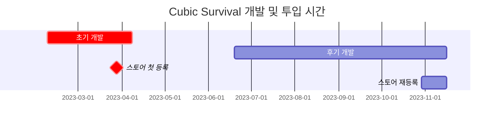

# **들어가며**

2023년이 찾아오고 저는 할 일을 또 찾아야 했습니다. 이번 해에는 재밌는 것을 만들어보고 싶다는 생각에 제야의 종이 치고나서 몇 가지 계획을 세워봤죠. 이왕이면 프로그래밍 숙련에 도움이 되면서도 제가 재밌게 즐길 수 있는 것으로 말입니다.

생뚱맞은 3개 정도 아이디어를 생각해보니 **육하원칙 기반 파이썬 라이브러리, 미러리스풍의 카메라 어플리케이션, 2D 모바일 게임** 등이 나왔습니다. 각각 **[파이썬 기반 프로그램](https://hynrang.github.io/posts/ASTP/)**이나 Android Studio로 간단한 어플리케이션을 빌드해본 경험, 또는 **[개인 유니티 프로젝트](https://hynrang.github.io/posts/LAV/)**에서 파생된 것이었어요.

그런데 게임개발 쪽이 너무 재밌어 보였습니다. 예전에 유니티를 다룬 경험 자체가 신기하게 남았기도 했고 당시에 에셋을 자급자족해서 사용해볼 수 있다는게 굉장히 재미있었거든요. 생고생이기는 하지만 남들에겐 없는 소재의 결과물을 만든다는 테마가 너무 매력적이었습니다. 마침 객체지향에 흥미가 있던 참이라, 객체지향 언어 C#을 제대로 다시 사용해보고 싶은 마음에 막무가내로 **2D 모바일 프로젝트**를 시작했습니다.

# **프로젝트 개요**



Cubic Survival의 개발기간은 기간상 초기 개발 기간과 중기 개발 기간으로 구분되기 때문에, 각각을 두 개 포스트에 나누어 개발과정을 리뷰하려 합니다. 따라서 이 포스트는 빨간색으로 강조된 '초기 개발'의 내용을 담고 있습니다.

지금에서야 말할 수 있는 거지만, 저는 처음에 이 프로젝트에 애착이 불을줄 몰랐습니다. 객체지향의 특징만 빠르게 구현해보고 다음으로 넘어가자는 마음으로 프로젝트 시작을 아주 가볍게 가져갔어요.  
그래서 이 프로젝트에는 "부드럽고 특이한 사용자경험을 구현하고 싶다", "필드를 돌아다니며 적을 처치하는 액션 게임을 만들어보고 싶다" 정도를 제외하면 명확한 기획이나 목표라고 할 만한 것이... 없습니다. 그나마 아래 정도를 특기할 수 있을 것 같네요.

- 시각적 디자인은 미니멀리즘을 추구할 것
- 씬 전환이나 카메라의 움직임 등을 부드럽게 처리할 것
- 객체지향 설계를 통해 상속과 다형성을 구현할 것
- 코루틴을 사용할 것

결과적으로 위 목표 모두 차례차례 달성하긴 했는데요, 각각 어디에서 어떻게 달성했는지는 코루틴을 제외하고 다음 글에서 세세하게 다루도록 하겠습니다.

# **초기 개발**

{: w="960" .shadow }
_극 초기의 게임플레이. 다섯 마리를 처치할 때마다 이벤트가 발생하면 어떨까 하고 생각했었다._

프로젝트의 비전이 약했기 때문에 자연스럽게 클론코딩 느낌으로, 우선 소단계에서 유명 게임의 기능들 중에 따라만들 수 있는 것을 따라만들어보자는 식으로 접근하게 되었습니다.

처음에는 "필드를 돌아다니며 적을 처치하는 액션 게임"으로 고등학교 때 친구들과 재미있게 플레이한 기억이 있는 소울 나이트와 브롤스타즈를 참고했습니다. 다만 "이 게임을 따라만들어보자", "이런 기능을 똑같이 만들어보자" 이런 느낌은 아니고, 대신 2D 모바일 플랫폼의 관점에서 "이런 느낌이구나" 하고 이해에 도움을 받는 정도였던 것 같네요.

## **조이스틱**

일반적인 2D 모바일 게임에 등장할 만한 조이스틱을 구현하고자 했습니다. 왼쪽에 플레이어 이동을 위한 조이스틱 하나와 오른쪽에 조준용 조이스틱 하나를 만들기로 했죠.

{: w="960" .shadow }

만들 때는 `Unity​Engine.​Input​System.​On​Screen` 패키지의 `OnScreenStick` 클래스를 활용해, 이 클래스에 기반한 새 스크립트를 두 개를 만들고 각각 위상차에 따라 플레이어와 조준용 투명 오브젝트를 `Translate()`하도록 만들었습니다. `​On​Screen` 패키지를 다루는 국내 자료가 별로 없어서 **[공식 문서](https://docs.unity3d.com/Packages/com.unity.inputsystem@1.7/api/UnityEngine.InputSystem.OnScreen.OnScreenStick.html?q=OnScreenStick)**를 많이 참고했어요.

여담으로, 스틱과 중심점을 LineRenderer을 통해 시각적으로 연결한다던가, 스틱이 탄성력을 가지고 튕기듯 중심점으로 돌아온다거나, 아니면 무기별로 조이스틱 조작법이 달라진다던가 하는 등의 구현하고 싶었던 아이디어가 많았는데요, 만들 당시 실력이 부족하기도 했고 게임 구조와 충돌하는 경우도 있어서 구현하지는 못했습니다. 대신, 조이스틱을 누르고 뗄 때마다 진동 피드백이 오는 정도만 만들었네요.

## **적 스폰 및 동작**

{: w="960" .shadow }
```cs
void spawnEnemy(GameObject Enemy, float east, float west, float south, float north)
{
    float spawnPointX = Random.Range(west, east);
    float spawnPointY = Random.Range(south, north);

    instantiatedEnemy = Instantiate(
        enemy,
        player.transform.position + new Vector3(spawnPointX, spawnPointY),
        transform.rotation
    );
}

IEnumerator spawnEnemies()
{
    for (int i = 0; i < data.spawnCount; i++)
    {
        spawnEnemy(Enemy, east, west, south, north);
        yield return new WaitForSeconds(spawnDelay);
    }
}
```
{: file="GameSystem.cs" }

처음에는 포탈 오브젝트를 만들어 지정된 지점에서 적이 인스턴스화되도록 만들어 만들기도 했는데, 만들어지고 난 후의 모습이 너무 단조로울 것 같아 위처럼 적이 플레이어 주위에서 생성되는 코드를 작성했습니다.

`east`, `west`, `south`, `north` 4개 매개변수를 기반으로 플레이어로부터 일정거리 떨어진 무작위 좌표값을 생성하도록 했습니다. 플레이어 주변에 적이 갑자기 나타나지 않게 해당 좌표값은 화면이 렌더링하는 영역 밖으로 지정되도록 별도로 처리했어요.

코루틴을 처음 사용해본 계기가 되었는데요, 유니티에서는 딜레이를 주는 방법이 예를 들어 `Delay()`와 같은 식으로 간단하게 제공되지 않더라고요. 대신 대부분이 코루틴 사용을 권장하고 있어서 `spawnDelay` 값만큼 간격을 두고 적을 스폰하는 코루틴을 만들었습니다.

```cs
void Move()
{
    dirTowardsPlayer = (player.transform.position - gameObject.transform.position).normalized;
    transform.Translate(dirTowardsPlayer * speed * Time.deltaTime);
}

void OnCollisionEnter2D(Collision2D collider)
{
    if (collider.gameObject.tag == "player")
    {
        player.hp -= damage;

        Vibration.Vibrate((long)20);
        Destroy(gameObject);
    }
}
```
{: file="Enemy.cs" }

적은 기본적으로 플레이어를 향해 움직이면서, 플레이어와의 충돌하면 진동 피드백과 함께 `damage`만큼 플레이어의 체력을 감소시키고 `Destroy()`되도록 만들었습니다.

## **인벤토리와 아이템**

게임 구조가 윤곽이 잡혀가다보니 아이템을 얻어 저장해두었다가 나중에 꺼내 사용할 수 있는 인벤토리가 있으면 좋겠다는 생각이 들었습니다. 여기는 스스로의 고민을 좀 한 부분인데요, 많은 게임에서 인벤토리 UI를 별도의 창으로 구성하거나 아예 만들지 않고 버튼 토글식으로 만들고 있었거든요. 둘 다 마음에 들지 않았습니다.

저는 인벤토리가 여러 개 아이템을 담을 수 있으면서도 그 UI가 플레이 경험을 해치지 않았으면 했습니다. 그래서 오른쪽 조이스틱에 할당되어있던 수동 조준 기능은 오토에임으로 대체하고, 새로운 인벤토리 액세스 기능을 할당했어요. 오른쪽 조이스틱을 꾹 누르면 인벤토리가 열리고, 손가락을 떼면 인벤토리가 닫히는 식으로요.

{: w="960" .shadow }
```cs
public struct InventoryData
{
    public string[]     Code;
    public GameObject[] UI;
    public GameObject[] ItemUI;
    public GameObject   Weapon;
    public int[]        Rounds;
}

for (int i = 0; i < InventoryData.InventoryUI.Length; i++)
    InventoryData.UI[i].transform.position = Vector3.Lerp(currentPos, targetPos[i], 2*t);
```
{: file="Inventory.cs" }

인벤토리는 오브젝트 8개를 이용해 액세스 시 플레이어 주변으로 오브젝트가 펼쳐지도록 했습니다. 이를 위해 인벤토리 액세스시 필요한 데이터(아이템 식별자, 인벤토리 오브젝트, 아이템 오브젝트, 무기 데이터, 에모 등)를 총괄할 수 있도록 위와 같은 구조체를 하나 만들었어요.

아이템은 필드에 스폰되는 용도의 오브젝트 하나와 UI로 동작할 오브젝트 하나로 분할하여, 플레이어가 필드 아이템을 획득하면 아이템 UI 오브젝트가 `ItemUI` 배열에 추가되도록 만들었습니다.

|아이템|ID|
|---|---|
|권총|WPPSTL|
|산탄총|WPPASG|
|미니건|WPMING|
|이동속도 증가 패시브|PVMSPD|
|공격속도 증가 패시브|PVATKR|
|...|...|

아이템 식별자는 위처럼 유형을 나타내는 2자리 뒤에 아이템 이름을 나타내는 4자리가 이어지도록 만들었습니다. 재미있었던 것은 만들 때는 모르고 있었는데, 아이템이 점점 많아지면서 "구분을 위해 고유 코드를 하나씩 만들어야겠다!"라고 자연스레 생각했던 그 발상이 나중에 알고보니 "식별자"라고 이름까지 있는 개념이었더라고요. 써보니 꽤 유용했어서 다음에도 계속 활용하려고 합니다.

## **무기 발사**

{: w="960" .shadow }
```cs
if (shotTimer > fireThreshold)
{
    for (int i = 0; i < bulletCount; i++)
    {
        instantBullet = Instantiate(
            bullet,
            FirePosition.transform.position,
            Quaternion.Euler(
                0, 0, transform.rotation.eulerAngles.z + Random.Range(MOA * -1, MOA) + 180
            )
        );
        Destroy(instantBullet, 1);
    }
}

shotTimer += Time.deltaTime;
```
{: file="Weapon.cs" }
```cs
void hasHitEnemy()
{
    hit = Physics2D.Raycast(transform.position, transform.right, 100);

    if (hit.collider != null && hit.distance < 1)
    {
        if (hit.collider.gameObject.tag == "enemy")
        {
            if (hit.collider.GetComponent<Enemy>().HP > 0)
                Destroy(gameObject);
            /* ... */
        }
    }
}
```
{: file="Bullet.cs" }

총알은 무기 오브젝트의 `FirePosition` 자식 오브젝트에서 생성되어 플레이어가 조준하고 있는 방향으로 직진하다가, 생성된지 1초가 지나면 사라지도록 만들었습니다. 탄퍼짐 효과를 구현하기 총알이 생성될 때 무기별로 지정된 `MOA` 변수값 내에서 `Random.Range()`로 각도의 Z축 값이 조금씩 보정되도록 만들었어요.

충돌검사는 레이캐스트를 이용했습니다. 그런데 총알 속도가 너무 빨랐는지, 레이캐스트로도 충돌검사가 제대로 이루어지지 않아 총알이 적을 그대로 통과해버리는 문제가 있더라고요. Ray 길이를 증가시키거나 Collider 범위를 넓혀도 해결이 되지 않았지만, 이 문제는 `hit.distance < 1` 조건을 추가해 해결할 수 있었습니다.

나중에 알고보니 총알 발사와 같이 오브젝트의 인스턴스화가 빈번히 일어나는 경우에 오브젝트 풀링(Object Pooling)이라는 최적화 기법을 사용할 수 있더라고요. 향후에 시간이 될 때 적용해보려고 합니다.

# **사용자 경험 디자인**

앞의 단락이 "필드를 돌아다니며 적을 처치하는 액션 게임을 만들어보고 싶다"에 대한 내용이었다면, 이 단락은 "부드럽고 특이한 사용자경험을 구현하고 싶다"에 대한 내용입니다. 제대로 된 비주얼 관련 작업은 대부분 후기 개발 단계에서 이루어졌다고 생각하기 때문에 다음 글에서 다루도록 하겠습니다.

## **카메라**

{: w="960" .shadow }
```cs
void Move()
{
    transform.position = Vector3.Lerp(
        transform.position,
        player.transform.position,
        Time.deltaTime * moveSpeed
    );
}

void Vignette()
{
    targetVignetteValue = inventoryIsOpen ? 0.35f : 0f;

    vignette.intensity.value  = Mathf.Lerp(
        vignette.intensity.value,
        targetVignetteValue,
        Time.deltaTime * vignetteSpeed
    );
}
```
{: file="Camera.cs" }

개인적으로 평소에 어도비 라이트룸을 이용해 **[사진](https://hynrang.github.io/posts/%EC%9E%84%EC%9D%B8%EB%85%84%EC%9D%98-%EC%82%AC%EC%A7%84/)**을 보정하면서 주의깊게 본 비네팅(Vignette)이라는 옵션이 있습니다. 이 기능은 화면 가장자리를 어둡게 만들어 시선을 중앙으로 모아주는데, 마침 유니티의 **[포스트 프로세싱](https://docs.unity3d.com/kr/2020.3/Manual/PostProcessingOverview.html)**에도 같은 옵션이 있어서 인벤토리가 열릴 때 이 효과를 적용하면 딱 알맞겠다고 생각했어요.

그래서 인벤토리 액세스시 비네팅값이 0.35정도 주어지도록 만들었습니다. 비네팅 동작은 카메라 움직임과 마찬가지로 Lerp을 이용해 부드럽게 처리했구요. 만들면서는 Lerp가 받는 `vignetteSpeed`와 `moveSpeed` 등의 인자값을 제가 원하는 느낌으로 잡아내는 것이 어려웠는데, 플레이하고 수정하고 플레이하고 수정하고, 다른 부분 작업하다가 또 마음에 안들 때 수정하면서 개발 내내 잡았던 것 같습니다.

<!--UI 넣을 수 있나?-->

## **URP**

{: w="960" .shadow }
_무기가 발사될 때마다 적 뒤로 그림자가 비친다._
<!--{: w="960" .shadow }-->

처음에는 Unity2D 환경의 기본 빛 효과를 어찌저찌 사용하다가, 여러군데 아쉬움이 있어 대안으로 **[URP(Universal Render Pipeline)](https://unity.com/srp/universal-render-pipeline)**를 적용하고 나니까 비주얼이 아주 좋아졌습니다. 기본적으로도 부드럽게 떨어지는 예쁜 빛 효과를 제공하면서도, 예를 들어 Falloff Strength 옵션을 조절해 더 은은하거나 화려한 빛을 만든다던가, Shadows 옵션으로 위처럼 빛과 그림자 효과를 연출하거나 할 수 있어서 정말 유용하게 사용했어요.

다만 나중에 총알이나 적 하나하나에 Light2D를 넣어보니 폰이 금세 뜨거워지더라구요. GPU 리소스를 꽤 잡아먹는 것 같아 적극적으로 사용하지는 못하고, 총이 발사될 때 화염효과를 풍성하게 만들어주는 용도로만 남겨놓게 되었습니다.

# **마치며**

초기 개발 활동을 간단히 정리했습니다. 쓰면서 느끼게 되는 게, 사실 이 기간에 느꼈던 것들이 생각보다 잘 기억나지 않네요. 메모를 자주 해뒀어야하는데 말이죠.여러가지 생각이나 노력을 다 담아내지 못한 것 같아 아쉽습니다.

그래도 여러가지 직접 구현해보면서 게임을 만드는 것이 제 생각보다 정교한 일이라는 것을 알게 되었습니다. 특히, 유행중인 트렌드를 따르지 않고 새로운 패러다임을 찾아다닌, 또 그것을 성공적으로 구현해낸 다른 게임들이 진짜 대단하다는 생각이 들었어요. 그런 것을 지향하는 저로써는 살짝 욕심이 났습니다.

여담으로, 호기심에 플레이스토어에 이 앱을 등록해본적이 있는데 살짝 후회하고 있습니다. 이유가 조금 어이없는데요...이 부분은 나머지 개발 과정과 함께 다음 글에서 다루도록 하겠습니다.