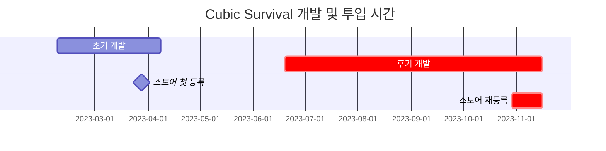
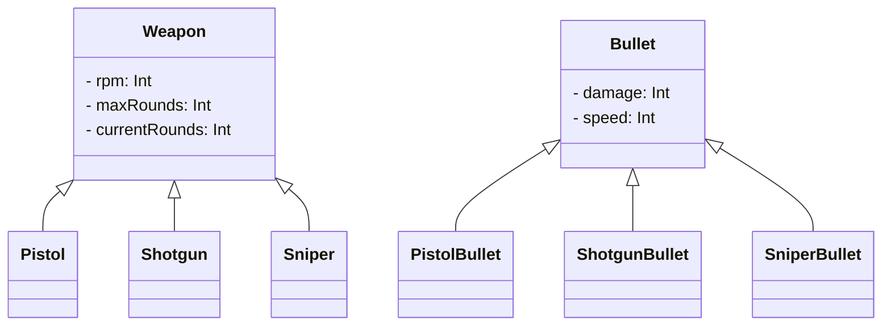

# **들어가며**

**[전 포스트](https://hynrng.github.io/posts/Cubic-Survival-Alpha/)**에서 이어지는 모바일 게임 개발기입니다. 위에서 정리한 대로 개발기간이 초기와 후기로 나뉘기 때문에 포스트를 분리해 정리했어요. 따라서 이 포스트에서는 후기 개발과 스토어등록 부분을 다룹니다.



# **후기 개발**

이 기간에 만들면서 든 생각이 많다 보니 정리하면서 글이 조금 길어졌습니다. 주로 만들면서 어떤 생각을 했고, 어떻게 만들었는지에 대한 경험을 최대한 구체적으로 정리했습니다.

## **무기 디자인**

### **동작 애니메이션**

<!--유니티 에디터 -> 탄피배출 GIF-->
<!--탄피배출 효과는 파티클이펙트로 구현했습니다.-->

{: w="960" .shadow }
{: w="960" .shadow }
```cs
if (shotTimer > fireThreshold)
{
    WeaponAnimator.SetTrigger("Fire");
}

shotTimer += Time.deltaTime;
```
{: file="Weapon.cs" }

애니메이션을 구현하면서 유니티 애니메이션 컴포넌트를 처음 사용해봤습니다. 생각보다 굉장히 직관적으로 만들어져 있어서 사용하기가 편했어요. 다른 기능을 이것저것 만져보니 단순히 여러 장의 사진을 연속적으로 보여주는 기능 외에도 오브젝트의 위상을 원하는 형태로 재생할 수 있도록 만들어져 있어서 간단한 반동 애니메이션도 함께 만들었습니다.

처음 만들었을 때는 어딘가 부족한 느낌이 있었는데, 화염 크기를 과장하고 URP Light2D를 활용하니 훨씬 화려한 효과를 얻을 수 있었습니다.

{: w="480" .shadow }
{: w="480" .shadow }

총구 화염은 클립스튜디오의 애니메이션 기능을 활용해 구현했습니다. 이전에 공식 에셋을 잘 활용한 경험이 있어서 이번에도 만들어져 있는 에셋을 사용할까 했지만, 제가 원하는 느낌에 딱 맞는 에셋을 찾아보기 힘들기도 했어서 이번에는 직접 만들어 썼어요. 만들면서는 **[다른 슈팅 애니메이션](https://www.youtube.com/watch?v=kAafHZcT2fc)** 등을 참고하면서 제가 원하는 느낌을 잡아갔습니다.

{: w="960" .shadow }
<!--코드-->

오브젝트가 새로 나타날때의 부자연스러움을 덜기 위해 무기를 바꾸거나 새로 얻었을 때에만 재생되는 애니메이션도 만들었습니다. 무기 전체를 덮는 실루엣 이미지가 서서히 투명해지는 사이에 플레이어가 총기를 살짝 조작하는 듯한 느낌이 나타나도록 했어요.

### **적 피격 이펙트**

{: w="960" .shadow }
{: w="960" .shadow }
```cs
public void Hit()
{
    ParticleSystem hitEnemyParticle = hit.collider.GetComponent<ParticleSystem>();
    hitEnemyParticle.Emit(particleNumber);
}
```
{: file="Bullet.cs" }

피격 효과는 파티클 시스템을 사용했습니다. 처음에는 파티클의 움직임을 무작위 방향으로 움직이다가 속도가 점점 줄어드는 정도로만 단순히 구현했다가, 생각보다 많이 어색해서 이걸 어떻게 구현해야 좋을지 고민을 좀 했습니다.

이는 좀 우연찮게 해결했는데요, 위처럼 Velocity over Lifetime 모듈에서 선형 속도와 공전 속도를 Random between two curves로 설정하고 그래프를 두번 꼬았더니 마치 먼지가 이는 듯한 효과가 만들어지더라구요. 보기에도 괜찮고 타격감도 꽤나 좋게 만들어주는 것 같아 그대로 사용했습니다.

### **장탄수 시스템**

{: w="960" .shadow }
{: w="960" .shadow }
```cs
public virtual void Update()
{
    if (roundsCurrent > 0)
        Fire();
    else if (!WeaponAnimationInfo.IsTag("Weapon_Reload"))
        WeaponAnimator.SetTrigger("RoundIsEmpty");
    else
        roundsCurrent = roundsMax;
}

public virtual void Fire()
{
    if      (currentRounds == 1) WeaponAnimator.SetTrigger("FiredLastRound");
    else if (currentRounds > 0)  WeaponAnimator.SetTrigger("Fired");

    roundsCurrent -= 1;
}
```
{: file="Weapon.cs" }

남은 총알을 표시하는 기능을 만들었습니다. 총알이 0이 되면 재장전 애니메이션이 재생되고, 재장전 애니메이션이 끝나면 장탄수는 무기 오브젝트에 설정된 최대 장탄수 값으로 회귀하도록 만들었어요. 플레이어 체력과 마찬가지로 UI가 난잡하게 되지 않도록 장탄수 UI는 플레이어의 머리 위에 게임오브젝트 형태의 UI로 표시되도록 만들었습니다.

재장전 애니메이션이 재생되는 도중에 무기가 바뀔 경우 장탄수가 제대로 채워지지 않은 채 무기 애니메이터 컴포넌트의 `bool`형 `magazineIsEmpty` 변수가 `true`로 설정되어 앞서 정리한  `Gained` 애니메이션과 구별되는 `GainedEmpty` 애니메이션이 재생되도록 만들었습니다.

### **데미지 이펙트**

{: w="960" .shadow }
{: w="960" .shadow }

데미지 이펙트 기능 자체는 초기 개발 때 구현했지만, 애니메이션이 아닌 코드로 구현되어 있기도 했고 그 비주얼도 많이 아쉬워서 조금 다듬어주었습니다.

만들면서 크리티컬 시스템도 간단하게 구현했습니다. 데미지가 2배가 될 때 전용 애니메이션이 재생되도록 했어요. 애니메이션은 크리티컬 데미지가 들어갔음을 쉽게 알 수 있도록 일반 데미지 애니메이션과 비교했을 때 크기와 색상에 가시적인 차이가 있도록 만들었습니다.

### **무기 다양화**


```cs
public abstract class Weapon : MonoBehaviour
{
    protected int   RPM;
    protected int   maxRounds, currentRounds;

    public virtual void Awake()
    {
        /* ... */
    }
}
```
{: file="Weapon.cs" }
```cs
public class Pistol : Weapon
{
    public override void Awake()
    {
        base.Awake();
        
        maxRounds           = 10;
        rotationSpeed       = 40;
    }
}
```
{: file="Pistol.cs" }

처음에는 총을 주로 만들 생각은 없었는데, 처음에 만들게 된 것을 재사용하려다보니 총을 여러개 만들게 된 것 같습니다. 위의 스나이퍼 말고도 기존의 미니건이나, 새로운 샷건, 기관단총 등을 새로 만들었어요.

만들면서는 객체지향 프로그래밍의 다형성을 의식하며 부모 역할을 하는 `Weapon` 클래스에 기본적인 것들을 작성하고 `Minigun`, `Shotgun`, `SMG` 등의 세부 무기 클래스가 이를 상속하도록 했습니다.

## **애니메이션**

<!--
개인적으로 저는 게임이 재미있는 이유 중에는 "화면 속 캐릭터가 힘차게 움직이는 모습을 구경하는 재미"가 있다고 생각합니다.

찾아보니 스켈레톤 애니메이션이라던가, 절차적 애니메이션이라던가 등등 유니티가 제공하는 애니메이션 시스템 속에도 흥미로운 스킬이 많이 있는 것 같아 다음에 시도해보려고 합니다.
-->

### **플레이어 이동**

{: w="960" .shadow }
{: w="960" .shadow }

플레이어에게 새 몸통과 움직이는 다리를 달아주었습니다. 플레이어가 조이스틱을 최대 범위로 끌었는지의 여부에 따라 걷는 애니메이션과 달리는 애니메이션이 적절하게 재생되도록 했어요.

애니메이션 동작의 어색함을 덜기 위해 조이스틱을 당긴 정도에 따라 걷는 애니메이션 재생 속도가 유동적으로 조절되고, 또 조준 방향에 따라 플레이어가 뒤로 걸어가도록 만들었어요.

### **경험치 시스템**

{: w="960" .shadow }
{: w="960" .shadow }

플레이 도중의 지루함을 덜기 위해 추가한 시스템입니다. 적을 처치하면 플레이어는 경험치를 얻고, 경험치가 일정량 도달하면 레벨이 오르며 플레이어가 강화되는 식이죠.

처음에는 플레이어가 경험치 파티클을 직접 얻어야 경험치를 획득할 수 있도록 만들었는데, 플레이 후반부로 가면 갈수록 화면이 지저분해지는 문제가 있어서 적을 처치한 즉시 경험치를 획득하는 방식으로 변경하게 되었습니다.

### **플레이 화면 진입**

{: w="960" .shadow }

개인적으로 프로그램이 돌아갈 때 딱딱 끊기는 것보다는 수평적으로 경험이 부드럽게 이어지는 것을 좋아합니다. 이 부분을 제 게임에도 적용해보고 싶었어요.

그래서 씬 전환시 플레이버튼을 누르면 버튼으로부터 플레이어가 등장하도록 만들었습니다. 경험치, 일시정지 버튼 등등 UI 또한 화면 가장자리에서 등장하도록 만들었어요.

## **이미지 애셋 생성**

{: w="960" .shadow }
_태블릿으로 그려낸 이미지._

이미지 애셋은 유니티 애셋스토어를 이용하지 않고 모두 스스로 만들어 사용했습니다. 앞서 무기를 픽셀아트 느낌으로 만들었더니 느낌이 생각보다 좋아서 다른 이미지도 픽셀아트로 만들었어요.

만들 때는 클립스튜디오를 사용했고, 이미지가 완성되면 배경이 제거된 png 확장자로 내보낸 뒤 이미지 각각의 크기대로 잘라내어 프로젝트에 임포트했습니다.

## **카메라**

**[사진 취미](https://hynrng.github.io/posts/%EC%9E%84%EC%9D%B8%EB%85%84%EC%9D%98-%EC%82%AC%EC%A7%84/)**를 통해 화각(FOV)이 중요함을 느낀 적이 있습니다. 그림이든 사진이든 영상이든, 2차원 형식을 공유한다면 화상 왜곡 효과와 함께 더 많이, 혹은 더 적게 보여줌으로서 생각보다 많은 것을 표현할 수 있거든요.

2D환경은 정사영(Orthographic) 방식으로 씬을 보여주므로 개념에는 차이가 있지만 "얼마나 더 넓게 담을 것인가"의 추상적인 관점에서는 2D에서도 고민할 부분이 있다고 생각했어요. 그래서 게임을 만들 때 `Camcam.orthographicSize`값이 제가 원하는 값으로 자주 변경되도록 만들었습니다.

<div class="row">
    <div class="col-md-6">
        
    </div>
    <div class="col-md-6">
        
    </div>
</div>

예를 들어 위에서 차례차례 다룬 무기의 재장전, 플레이 씬으로의 전환 등등의 경우, 재장전 시에는 시야를 좁혀 일시적인 무력감이 표현된다면 재미있겠다는 생각이 들었고, 플레이가 시작될 때 역시 시야를 좁혀 긴장감을 줄 수 있지 않을까 하는 생각에 카메라가 보여주는 영역이 좁아지도록 만들었어요.

이외에 URP를 통해 블룸(Bloom) 포스트 프로세싱 효과도 신경을 썼습니다. 다른 포스트 프로세스 효과 중에 블러, 모션블러 정도도 시도는 해봤지만 결과물을 보니 너무 과하다는 생각이 들어 블룸 하나만 적용하게 되었네요.

## **오디오**

{: .shadow }
_크리티컬 효과음_

배경음, 효과음 등 소리 관련된 것들이 막상 하자니 조금 당혹스러웠던 부분이었습니다. 사운드를 어디서 어떻게 구해야 하는지도 잘 몰랐고, 어떻게 편집해야 하는지도 잘 몰랐거든요.

**[유니티 에셋 스토어](https://assetstore.unity.com/ko)**에도 제가 원하는 효과음이 없어서, 대신 주로 **[Pixabay](https://pixabay.com/ko/sound-effects/)**나 **[GDC Game Audio](https://sonniss.com/gameaudiogdc)**에서 무료 오디오를 얻은 후**[Audacity](https://www.audacityteam.org/)** 오디오 편집 프로그램을 이용해 노이즈 감소나 저음 증가 등의 효과를 준 뒤 임포트하여 사용했습니다.

## **IAA (인앱 광고)**

{: w="960" .shadow }
```cs
void PlayerDied()
{
    ShowInterstitialAd();
}
```
{: file="GameSystem.cs"}

후기 개발중에서는 거의 처음에 구현했던 기능입니다. 이것저것 궁금한 마음에 호기심에 플레이어가 죽으면 보상형 전면 광고가 나타나도록 만들었습니다.

만들면서는 **[구글 애드몹 공식 문서](https://developers.google.com/admob/unity/banner?hl=ko)**를 참고했어요. SDK 가이드를 따라가니 제 예상보다 너무 간단하고 깔끔하게 잘 작동해서 신기했습니다.

## **IAP (인앱 결제)**

{: w="960" .shadow }
```cs
void Purchase()
{
    if (playerDonateKimbab)
    {
        DonateKimbab();
        playerDonateKimbab = false;
    }
}
```
{: file="GameSystem.cs"}

인앱 광고를 구현한 뒤에 이어지는 사고의 흐름을 따라 인앱 결제 기능을 구현했습니다. 게임 내에서 통용되는 화폐나 아이템 등이 없기 때문에 인앱결제 기능은 후원의 형태로 만들게 되었어요. 김밥, 불닭, 스테이크 등 3개 음식을 구상해 구글 콘솔에서 인앱 상품을 신청한 뒤 게임 내에서 보상 없이 결제가 이루어지도록 만들었습니다.

구현 도중에 인앱결제를 구현할 때 조심해야 하는 것이 보안이라는 말을 들었습니다. 지금의 경우에는 실질적인 소득을 상정한 것은 아니기 때문에 큰 상관은 없지만,  다음에 인앱결제를 또다시 구현하게 될 경우에는 조금 주의해야겠다는 생각이 들었습니다.

# **스토어 등록**

## **등록 준비**

{: w="240" .shadow }
_어플 로고_

통일성을 위해 어플 로고는 플레이버튼과 동일한 이미지로 만들었습니다. 이 프로젝트에 있어서 스토어 등록은 약간의 상징적인 의미가 있는 것이지, 이 게임으로 관심을 끌고 싶다 이런 생각은 없어서 직관성이 떨어지는 것은 감수하기로 했어요.

어플의 패키지명은 `com.payang.palette`로 정했습니다. `payang`은 개발자 계정 이름으로부터, `palette`는 개인적으로 어플명 대신 부르던 프로젝트명에서 따왔습니다.

## **스토어 등록**

{: w="960" .shadow }
_신기한 구글 콘솔 창_

어플 등록은 플레이스토어로 한정했고, 이를 위해 구글 콘솔을 이용했습니다.

사실 등록 자체는 **[초기 개발 단계](https://hynrng.github.io/posts/Cubic-Survival-planning/)**에서 진행을 했는데, 어플 등록 과정에는 어떤 절차가 있는지, 그런 절차를 모두 완료하면 정말로 어플이 올라가는지 등등 개발 도중 호기심에 등록한 거라, 등록 후 게임이  검색되는 것을 확인한 후에 바로 어플을 비활성화시켰었습니다.

그리고 반년 넘게 시간이 지나고 이제 슬슬 그만 만들고 싶기도 하고, 게임의 완성도가 처음보다 조금 봐줄만해졌다 싶어서 어플을 업데이트한 후 활성화하기로 했어요. 등록중에 있어서는 어플명과 어플 설명을 작성했고, 앱 아이콘과 그래픽 이미지, 그리고 자체 스크린샷 3장을 업데이트했습니다.

{: w="960" .shadow }
_구글 플레이 스토어_

최종적으로 어플이 다시 활성화되어 다운로드받을 수 있게 되었습니다. 어플 활성화 후 일주일 정도의 시간도 지나서, 제목을 검색하면 노출이 되는 상태에요.

## **홍보와 피드백**

게임이 만들어졌으면 플레이해주는 사람이 있어야겠죠. 홍보도 마찬가지로 생각을 해본 적이 없었는데 그래도 만든 것이 '게임'이니 플레이해주는 사람이 있으면 좋겠다는 생각이 들었습니다.

그런데 이 게임은 처음부터 플레이하라고 만들었다기보단 토이 프로젝트로 도전했던 게 재미를 붙이다보니 스케일이 점점 커진 경우에 가깝다 보니, 이걸 홍보하는게 맞는건가 하는 걱정이 들고, 또 막상 제가 만든 것을 알리려니 부끄러움이 앞서더라구요.

{: w="960" .shadow }

그래도 용기를 내서 해외 **[Unity2D 서브레딧](https://www.reddit.com/r/Unity2D/)**에 짧은 글을 올렸습니다. 한 100명 봐주면 정말 감사하겠다 하는 마음가짐으로 글을 올렸는데, 일주일만에 조회수가 2만을 넘더니 한달 정도가 지나자 무려 10만에 가까운 분들이 관심을 가져주셨어요.

{: w="960" .shadow }

그중에 몇몇 분은 정말 감사하게도 직접 플레이하셔서 위와 같이 상세한 피드백까지 남겨주셨습니다. "조이스틱의 위치가 수정 불가능한 채로 고정되어 있어 불편하다", "블룸(Bloom)이 과한 것 같다", "타 게임과 비슷해 보인다" 정도의 피드백이 있었네요.

피드백은 공감이 드는 부분이 있지만, 당장은 더 이상 개발을 진행하고 싶지는 않아서 시간이 날 때 수정하거나 차기 프로젝트를 진행하게 되면 반영하고자 합니다.

# **후기**

이것으로 하나의 게임 개발을 마쳤습니다. 반 년 정도 신경을 쓰면서 시간을 보냈네요. 게임 개발을 하면서 개인적으로 가장 크게 느꼈던 것이 세 가지 정도 있습니다.

하나는 애니메이션을 만드는 것은 재미있고 뿌듯한 일이기는 하지만, 일일히 수작업으로 진행을 해야 하기 때문에 시간을 굉장히 많이 요구한다는 겁니다. 전문 애니메이터가 아닌 이상 원하는 느낌의 애니메이션을 만드는 것은 마음의 준비를 해야 하는 일이고, 또 오브젝트별로 전용 애니메이션을 만드는 것은 비효율적입니다. 가능하면 여러개의 오브젝트가 같은 애니메이션을 공유할 수 있도록 만드는 것이 효율적이라는 생각이 들었어요.

다른 하나는 기획 없이 즉흥적인 바텀업 방식으로 프로젝트를 만드는 것은 소규모 맥락에 있어서 재미는 있을지언정 그 한계가 분명히 있다는 것입니다. 개발을 하다가 흐름이 끊기고, 애니메이션을 만들다가 흐름이 끊기고, 마음에 안 들면 만들어놓은 작업물을 되돌리거나 삭제하고 새 작업물을 다시 만드는 일이 많았어요.  
때문에 처음에 기획을 치밀하게 준비했다면 이런 비효율적인 일은 예방할 수 있었을 것이라는 아쉬움이 계속 들었습니다. 그래서 다음에는 초기에 기획을 열심히 잡고 가려고 해요.

마지막으로 시간관리에 대한 부분입니다. 이 프로젝트는 원래 겨울방학에 길어야 한 달 정도 짧게 진행하고자 시작한 프로젝트였는데, 재미가 있다보니 여름방학 프로젝트가 되고, 또 그 다음 겨울방학 프로젝트가 될 뻔했어요.  
학기중에 개발을 병행하면서 게임을 만드는 일이 너무 재미있다보니 학업이 심리적 2순위로 밀리는 일이 일어나기도 했습니다. 자연스레 성적에 영향이 가면서 시간관리를 잘 못했다는 아쉬움이 남았네요.

<div class="row">
    <div class="col-md-6">
        
    </div>
    <div class="col-md-6">
        
    </div>
</div>

그래도 만드는 과정이 너무 재미있고 뿌듯한 경험으로 남아서 다음의 마일스톤 또한 유니티로 만들게 되지 않을까 싶습니다. 처음이 어렵지, 두번이 어려울 것 같지 않기도 하구요.

마지막으로, 관심이 있는 분들은 **[플레이스토어](https://play.google.com/store/apps/details?id=com.payang.palette&hl=ko-KR)**에서 다운받아 플레이해보실 수 있습니다.