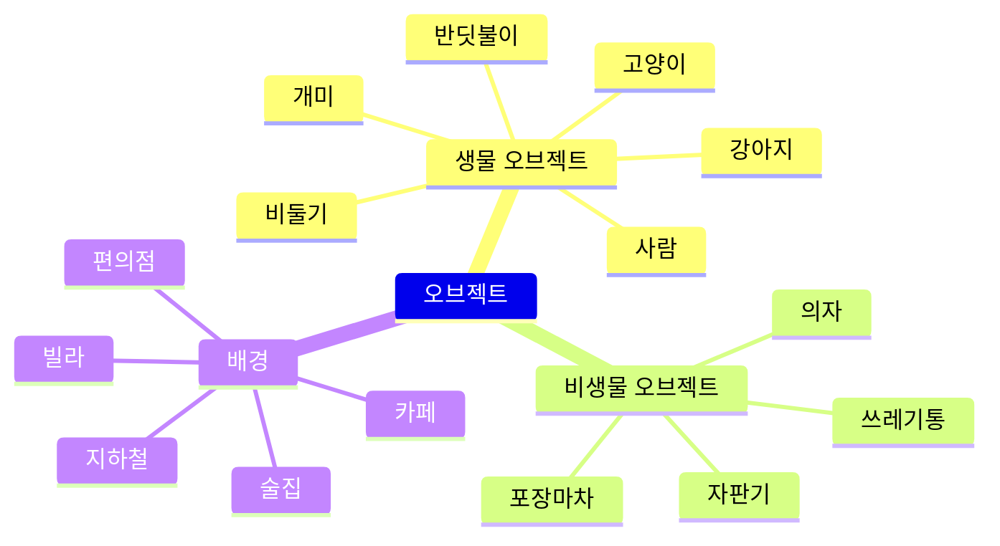
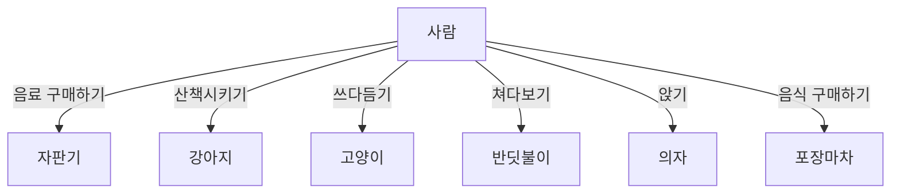
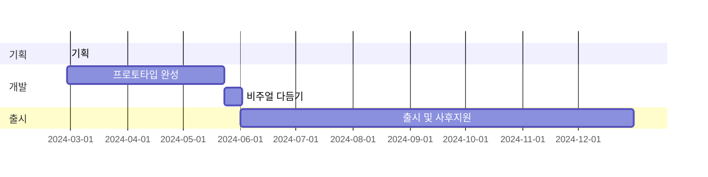

# **들어가며**

**[직전의 경험](http://127.0.0.1:4000/posts/Cubic-Survival-developing/)**을 마무리하고 새 유니티 프로젝트를 시작하려던 참에 10년 전에 보았던 영화를 다시 보고 경험이 가지는 영향력에 대해 생각을 하게 되었습니다. 생각이 어느정도 정리된 후 좋은 영화가 좋은 경험으로 남는 것처럼 저도 그런 것을 만들어보고 싶다는 생각을 하게 되었죠. 평소 이것저것 만들고 표현하고 싶은 마음이 있기도 했구요.

{: .w-50 .shadow }
_친구와 떠들면서 그린 간이 컨셉아트_

경험에 초점을 맞추어, 단순히 플레이어가 아무 조작을 하지 않아도 씬 내의 오브젝트들이 알아서 서로 상호작용하는 환경을 구상했습니다. 점수나 게임 종료 조건 없이 단순히 구경하며 돌아다니기만 하는 게임이죠.  
위 아이디어를 바탕으로 "이런 것이 있으면 좋겠다"는 마음으로 빠르게 그림을 그려봤는데 느낌이 생각보다 좋고 반응도 괜찮아서 이대로 만들어보고 싶다는 생각이 들어 그대로 기획을 구상하기 시작했습니다.

# **기획**

이전에 가장 아쉬웠던 점이 기획의 부재입니다. 참고할 지표와 장기 플랜이 없으니 거시적으로는 게임의 방향성을 잡기 어려웠고, 미시적으로는 예를 들어 리텐션이나 수익성을 생각하기 어려웠습니다. 그래서 이번에는 기획을 먼저 어느정도 구성하고 가려고 해요.

게임 기획에 도움이 되는 개념이 혹시 있을까 찾아보니 GDD(Game Design Document)라는 것을 알게 되었습니다. 일종의 게임 명세서인데, 정해진 양식이 있는 것은 아니라서 **[유니티에서 제작한 GDD](https://connect-prd-cdn.unity.com/20201215/83f3733d-3146-42de-8a69-f461d6662eb1/Game-Design-Document-Template.pdf)** 양식을 참고하여 필요한 부분만 미리 기술해두려고 합니다.

## **간이 GDD**

기본 설명
: - 이름: 행선지 (영어: Waybound)
- 장르: 어드벤처
- 형식: 2.5D 모바일

게임플레이
: - 플레이어는 도시 외곽 환경에서 사람, 강아지, 고양이, 개미 등 환경을 구성하는 생물이 되어 해당 생물에게 주어진 상호작용을 하게 됨. 사람은 예를 들어 자판기에서 음료를 꺼내 먹거나 길거리 의자에 앉을 수 있고, 강아지는 예를 들어 주인과 산책을 하거나 전봇대에 영역표시를 할 수 있음.  
플레이어가 특별히 생물을 조종하지 않더라도 생물은 서로 상호작용을 하고 도시 외곽 분위기를 구성하며, 각각의 생물은 사전 설정된 값에 따라 외형적인 개성을 가짐

주요 특징
: - 오브젝트간 다양한 상호작용
- 수작업 그림 이미지와 컷 애니메이션
- 비, 눈 등 날씨에 따라 달라지는 경험

## **예시 오브젝트**

## **예시 상호작용**

# **목표**

## **기술적 목표**

이전까지 변수나 함수명을 작성함에 있어서 혼란이 많았습니다. 일관성과 직관성 둘 중 어느 것도 잘 잡지 못했죠. 당연히 점점 코드를 읽고 수정하기가 버거워지게 되었습니다.

그러던 중 유니티 블로그에서 **[네이밍 컨벤션을 정리한 글](https://unity.com/how-to/naming-and-code-style-tips-c-scripting-unity)**을 접하게 되면서 조금의 충격을 받았습니다. 처음부터 알았더라면 훨씬 편리했을 텐데 하고 말이죠. 결과적으로 변수명과 함수명은 C#에서 언제 어떤 것을 써야 하는지, 어떤 식으로 작성하면 안 되는지를 명확하게 알 수 있었습니다.

제가 알아야 하는 관행이 더 있는지 찾다보니 마찬가지로 유니티에서 발간한 **["Level up your code with game programming patterns"](https://blog.unity.com/games/level-up-your-code-with-game-programming-patterns)** E북을 추가로 알게 되었습니다. 천천히 정독하면서 SOLID 원칙이나 팩토리 패턴, 상태 패턴 등등 여러가지 활용 가능한 기술이 있다는 것을 알게 되었고, 이를 토대로 파생 패턴을 찾아보면서 보다 체계적인 코드 설계를 위해 일정부분 도전해보고 싶은 것들이 생겼습니다. 추려보니 아래와 같이 정리할 수 있네요.

- PlasticSCM
- 이벤트 주도적 프로그래밍
- 엄격한 네이밍 컨벤션
- 절차적 애니메이션

이중 PlasticSCM은 깃허브를 대체하기 위한 버전 관리 시스템(VCS)으로 개발 도중 간간히 작업물을 저장해두기 위해 사용하려고 합니다. 이벤트 주도적 프로그래밍, 네이밍 컨벤션 등은 이 프로젝트를 통해 얻고자 하는 개발역량의 핵심이고요. 이외에 싱글톤 패턴, 코루틴, 델리게이트, get set 프로퍼티 등 기존에 사용하던 것들도 더 잘 활용해보고자 하는 작은 목표도 있습니다.

## **예술적 목표**

기본적으로 선과 그림이 움직이는 경험을 통해 우리 주변의 일상적인 분위기를 묘사하는 것이 목표입니다. 그런 것들을 눈에 충분히 띄면서도 자극적이지는 않은 느낌으로 표현할 수 있으면 좋겠어요. 가능하면 영상 표현물 같은 연출을 지향하면서 구체적으로는 아래 정도를 활용하려고 합니다.

- 컷 애니메이션
- 톤커브 곡선

전반적으로 유저가 가만히 게임속 화면이 돌아가는 장면을 보고만 있어도 어떤 애니메이션 영화 클립처럼 느껴질 수 있는 수준으로 최대한 만들고자 합니다.

다만 제가 그 정도의 역량이 될까 고민이 되는 부분은 있는데 특히 강아지, 고양이, 비둘기 등 동물의 움직임을 컷 애니메이션으로 그려내는 것은 프로 애니메이터의 영역이라고 들은 적이 있습니다. 그 정도로 움직임을 자유자재로 다룰 수 있어야 하는 상황은 아니지만, 배경지식이나 경험이 없기 때문에 시행착오가 많이 있을 것 같네요.

<!--이외에 오디오 관련해서도 기본적으로 3D환경에서 개발하는 만큼 일부 기법을 다루고 싶습니다. (그 뭐지 사운드 울리고 그런거)-->

# **로드맵**

